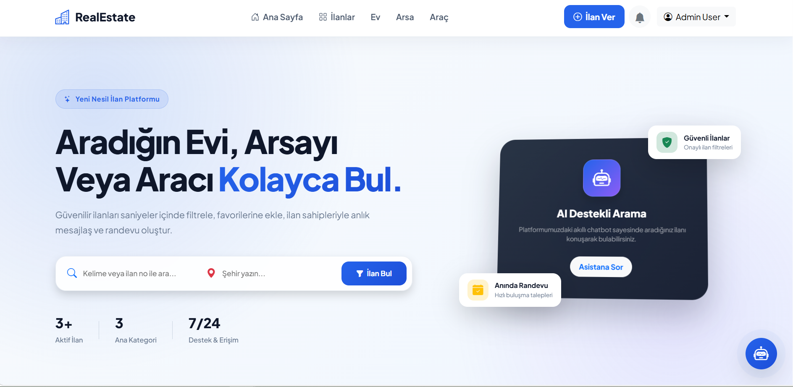
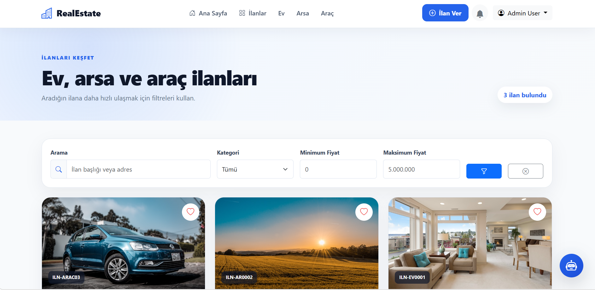
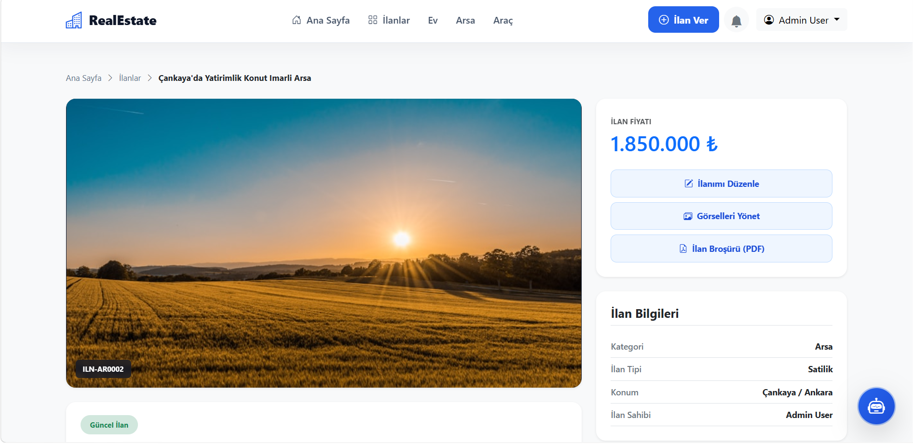
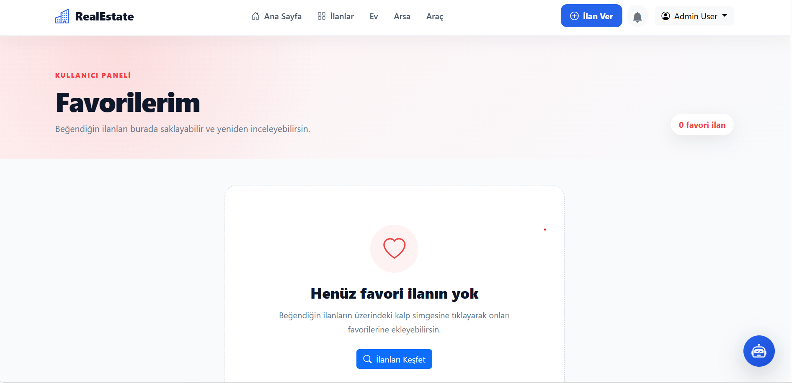
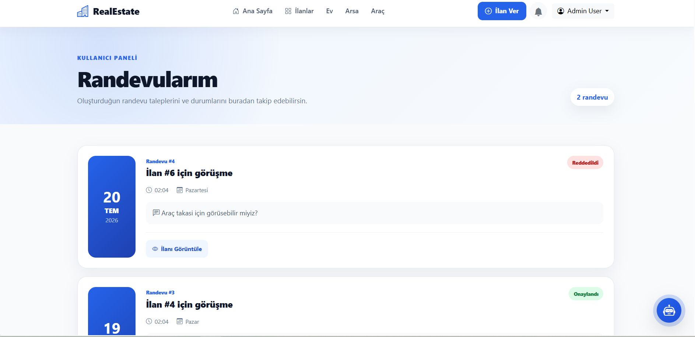
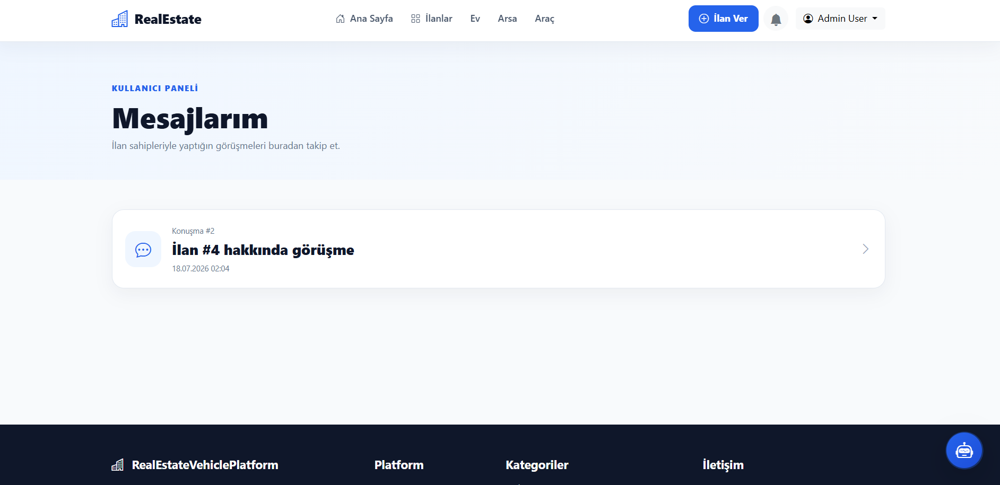
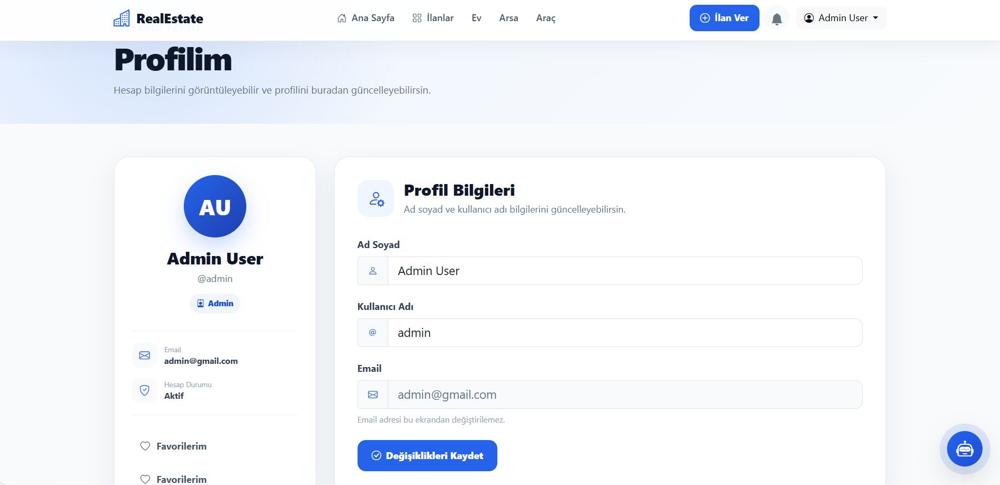
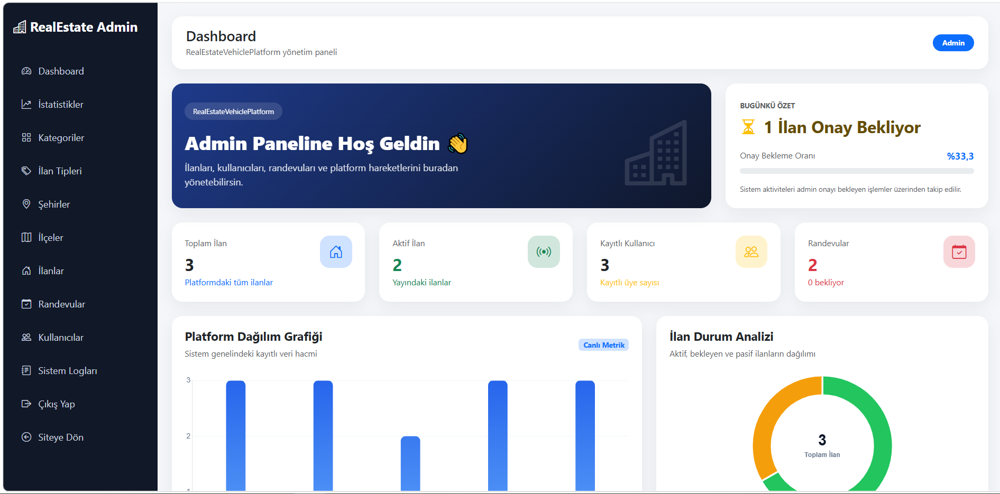
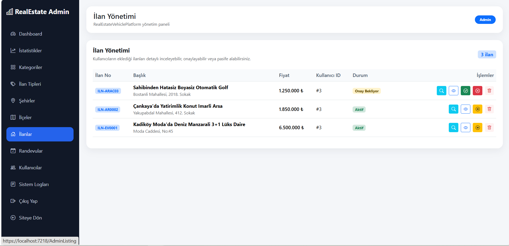

<!-- ========================================================= -->
<!-- HEADER -->
<!-- ========================================================= -->

<div align="center">

# 🏡🚗 RealEstateVehiclePlatform

### Modern Real Estate & Vehicle Marketplace Platform

### Graduation Project | ASP.NET Core 9 Web API • ASP.NET Core MVC • Entity Framework Core • Dapper • SQL Server • ASP.NET Identity • JWT Authentication

A comprehensive marketplace platform where users can publish, browse and manage **Real Estate (House & Land)** and **Vehicle** listings through a modern web interface.

The project follows **Enterprise Architecture** principles and was developed as a **Graduation Project** to demonstrate professional backend and full-stack development skills using the Microsoft .NET ecosystem.

---


<br>


</div>

---

# 📖 About Project

RealEstateVehiclePlatform is a **full-stack marketplace application** developed as a graduation project using modern Microsoft .NET technologies.

The platform allows users to publish, browse and manage **houses**, **lands** and **vehicles** through a responsive web interface while administrators manage the entire system from an advanced administration panel.

Unlike traditional CRUD applications, this project focuses on enterprise-level software architecture and implements modern software development principles such as:

- Layered Architecture
- Repository Pattern
- Generic Repository
- Unit Of Work
- Dependency Injection
- SOLID Principles
- RESTful API
- JWT Authentication
- ASP.NET Identity
- Role-Based Authorization

The application has been designed to be scalable, maintainable and reusable, making it suitable for real-world business scenarios.

---

# 🎯 Project Goals

The primary objectives of this graduation project are:

- Build a real-world marketplace application
- Apply Clean Architecture principles
- Develop secure authentication and authorization
- Design scalable software architecture
- Build reusable business logic
- Develop RESTful APIs
- Integrate Entity Framework Core & Dapper
- Improve backend development skills
- Demonstrate enterprise software development practices

---

# ✨ Project Highlights

✔ Enterprise Layered Architecture

✔ ASP.NET Core Web API

✔ ASP.NET Core MVC

✔ Entity Framework Core

✔ Dapper Integration

✔ SQL Server

✔ ASP.NET Identity

✔ JWT Authentication

✔ Repository Pattern

✔ Generic Repository

✔ Unit Of Work

✔ Dependency Injection

✔ Role-Based Authorization

✔ Responsive Design

✔ SweetAlert Notifications

✔ Listing Approval Workflow

✔ Multiple Image Management

✔ Favorite System

✔ Appointment System

✔ User Messaging

✔ User Profile Management

✔ Admin Dashboard

✔ Modern UI/UX

---

# 📸 Project Screenshots

> Screenshots will be updated as the project progresses.

---

## 🏠 Home Page



---

## 🔍 Listing Page



---

## 📄 Listing Detail



---

## ❤️ Favorite Listings



---

## 📅 Appointment Management



---

## 💬 Messaging



---

## 👤 User Profile



---

## 📷 Listing Image Management


---

## 🛠 Admin Dashboard



---

## 🏘 Listing Management



---

## 🏙 Category Management


---

## 🌍 City Management


---

## 📍 District Management


---

# 🚀 Project Features

## 👤 User Features

### 🔐 Authentication

- User Registration
- Secure Login
- JWT Authentication
- ASP.NET Identity
- Role-Based Authorization
- Session Management

---

### 🏠 Listing Management

Users can

- Create Listings
- Update Their Listings
- Delete Their Listings
- View Their Listings
- Search Listings
- Filter Listings
- Browse Listing Details
- View Listing Statistics

---

### 🖼 Listing Images

Each listing supports

- Multiple Images
- Main Image Selection
- Image Ordering
- Image Deletion
- Gallery View

---

### ❤️ Favorite System

Users can

- Add Listings to Favorites
- Remove Favorites
- View Favorite Listings
- Real-Time Favorite Synchronization

---

### 📅 Appointment System

Users can

- Create Appointment Requests
- Track Appointment Status
- Manage Their Requests

---

### 💬 Messaging

Users can

- Contact Listing Owners
- Start Conversations
- View Chat History
- Continue Previous Conversations

---

### 👤 Profile

Users can

- Update Personal Information
- Manage Listings
- Manage Favorites
- Manage Appointments
- Change Password

---

## 🛠 Administrator Features

Administrators have full control over the platform.

### Dashboard

- Listing Statistics
- User Statistics
- Appointment Statistics
- General System Overview

---

### Listing Management

- Approve Listings
- Reject Listings
- Deactivate Listings
- Delete Listings

---

### Master Data Management

Administrators can manage

- Categories
- Listing Types
- Cities
- Districts

---

### User Management

- View Users
- Manage User Accounts
- Role Management

---

### Appointment Management

- View Appointment Requests
- Update Appointment Status
- Manage Customer Requests

---

### Content Management

- Listing Images
- Platform Data
- General Administration

---
# 🏛 Project Architecture

The project follows a **Layered Architecture** approach to ensure maintainability, scalability and separation of concerns.

```
                          Client (Browser)
                                 │
                                 ▼
                    ASP.NET Core MVC WebUI
                                 │
                                 │ HTTP / JSON
                                 ▼
                     ASP.NET Core RESTful API
                                 │
                                 ▼
                     Business (Service Layer)
                                 │
                                 ▼
               Repository Pattern + Unit Of Work
                                 │
                                 ▼
                   Entity Framework Core / Dapper
                                 │
                                 ▼
                            SQL Server
```

---

# 📁 Solution Structure

```
RealEstateVehiclePlatform
│
├── RealEstateVehiclePlatform.Entities
│   │
│   ├── Abstract
│   ├── Concrete
│   ├── DTOs
│   ├── Enums
│   └── Configurations
│
├── RealEstateVehiclePlatform.DataAccess
│   │
│   ├── Context
│   ├── Repository
│   ├── Interfaces
│   ├── UnitOfWork
│   ├── Migrations
│   └── EntityConfigurations
│
├── RealEstateVehiclePlatform.Business
│   │
│   ├── Interfaces
│   ├── Services
│   ├── Validators
│   └── DependencyInjection
│
├── RealEstateVehiclePlatform.EfApi
│   │
│   ├── Controllers
│   ├── Middleware
│   ├── JWT
│   ├── Program.cs
│   └── appsettings.json
│
├── RealEstateVehiclePlatform.DapperApi
│   │
│   ├── Controllers
│   ├── Queries
│   └── Services
│
└── RealEstateVehiclePlatform.WebUI
    │
    ├── Controllers
    ├── Views
    ├── ViewModels
    ├── Services
    ├── Helpers
    ├── wwwroot
    └── Program.cs
```

---

# ⚙ Technologies

| Backend | Frontend | Database | Other |
|----------|----------|----------|--------|
| ASP.NET Core 9 | ASP.NET MVC | SQL Server | Entity Framework Core |
| ASP.NET Web API | Razor Pages | Code First | Dapper |
| ASP.NET Identity | Razor Syntax | LocalDB | LINQ |
| JWT Authentication | Bootstrap 5 | Relationships | AutoMapper |
| Dependency Injection | HTML5 | Foreign Keys | FluentValidation |
| Repository Pattern | CSS3 | Constraints | Generic Repository |
| Unit Of Work | JavaScript | Indexes | SweetAlert2 |
| SOLID Principles | jQuery | Migrations | Bootstrap Icons |
| REST API | Responsive Design | | Session Management |

---

# 🧩 Design Patterns

The project applies several enterprise-level software design patterns.

| Pattern | Purpose |
|----------|---------|
| Repository Pattern | Separates database operations from business logic |
| Generic Repository | Reduces duplicated CRUD operations |
| Unit Of Work | Manages transactions across repositories |
| Dependency Injection | Reduces coupling between classes |
| Layered Architecture | Separates application responsibilities |
| SOLID Principles | Improves maintainability and scalability |

---

# 🔐 Authentication Flow

```
User Login
      │
      ▼
ASP.NET Identity
      │
      ▼
Password Verification
      │
      ▼
JWT Token Generation
      │
      ▼
Session Storage
      │
      ▼
Authorized API Requests
      │
      ▼
Protected Controllers
```

---

# 👥 Authorization

```
                User
                 │
      ┌──────────┴──────────┐
      ▼                     ▼

Authenticated         Administrator

Create Listing        Manage Users
Favorites             Manage Listings
Appointments          Manage Categories
Messaging             Manage Cities
Profile               Manage Districts
Own Listings          Approve Listings
```

---

# 🏠 Listing Workflow

```
User

│

▼

Create Listing

│

▼

Pending

│

▼

Admin Review

│
├──────────────┐
│              │
▼              ▼

Approved     Rejected

│
▼

Published

│
▼

Visible To Everyone
```

---

# ❤️ Favorite Workflow

```
Browse Listings

│

▼

Click Heart Icon

│

▼

Favorite Added

│

▼

Favorite List

│

▼

Remove Favorite
```

---

# 📅 Appointment Workflow

```
User

│

▼

Select Listing

│

▼

Appointment Request

│

▼

Listing Owner

│

▼

Approve / Reject

│

▼

Appointment History
```

---

# 💬 Messaging Workflow

```
Listing Detail

│

▼

Send Message

│

▼

Conversation Created

│

▼

Messaging Screen

│

▼

Reply

│

▼

Conversation History
```

---

# 🖼 Listing Image Workflow

```
Create Listing

│

▼

Upload Images

│

▼

Save Images

│

▼

Select Main Image

│

▼

Gallery

│

▼

Delete Image
```

---

# 🔄 Data Flow

```
Browser

↓

MVC Controller

↓

ApiService

↓

REST API

↓

Business Layer

↓

Repository

↓

Unit Of Work

↓

Entity Framework / Dapper

↓

SQL Server
```

---

# 🔗 API Communication

```
MVC

↓

HTTP Client

↓

REST API

↓

JSON Response

↓

ViewModel

↓

Razor View
```

---

# 📊 Project Statistics

| Category | Count |
|-----------|------:|
| Projects | 6 |
| Layers | 6 |
| Entity Classes | 15+ |
| Controllers | 20+ |
| ViewModels | 40+ |
| DTOs | 25+ |
| Database Tables | 15+ |
| Admin Modules | 8+ |
| User Modules | 10+ |
| REST Endpoints | 70+ |

---

# 🎯 Software Engineering Principles

The project has been developed according to modern software engineering practices.

- ✅ Clean Code
- ✅ SOLID Principles
- ✅ Layered Architecture
- ✅ Separation of Concerns
- ✅ Dependency Injection
- ✅ Repository Pattern
- ✅ Unit Of Work
- ✅ RESTful API Design
- ✅ Object-Oriented Programming
- ✅ Authentication & Authorization
- ✅ Reusable Components
- ✅ Responsive UI
- ✅ Maintainable Code
- ✅ Scalable Architecture

---# 🗄 Database Structure

The application uses **Entity Framework Core Code First** with SQL Server.

The database has been normalized and designed according to relational database principles.

---

## Main Tables

| Table | Description |
|---------|-------------|
| AppUsers | Stores application users. |
| AspNetUsers | ASP.NET Identity users. |
| AspNetRoles | Identity roles. |
| Categories | Listing categories (House, Land, Vehicle). |
| ListingTypes | Sale / Rent types. |
| Listings | Stores all published listings. |
| HouseDetails | House specific information. |
| LandDetails | Land specific information. |
| VehicleDetails | Vehicle specific information. |
| ListingImages | Multiple images for listings. |
| Favorites | User favorite listings. |
| Appointments | Appointment requests. |
| Conversations | User conversations. |
| Messages | Chat messages. |
| Cities | City information. |
| Districts | District information. |

---

# 🌐 REST API Modules

The project exposes RESTful endpoints for all business operations.

## Authentication

- Register
- Login
- JWT Token
- Identity

---

## Listings

- Get Listings
- Get Listing Detail
- Create Listing
- Update Listing
- Delete Listing
- My Listings
- Approve Listing
- Reject Listing
- Passive Listing

---

## Categories

- Get Categories
- Create Category
- Update Category
- Delete Category

---

## Listing Types

- Get Listing Types
- Create Listing Type
- Update Listing Type
- Delete Listing Type

---

## Cities

- Get Cities
- Create City
- Update City
- Delete City

---

## Districts

- Get Districts
- Create District
- Update District
- Delete District

---

## Favorites

- Add Favorite
- Remove Favorite
- My Favorites

---

## Appointments

- Create Appointment
- Update Appointment
- Appointment List
- My Appointments

---

## Messaging

- Create Conversation
- Send Message
- Conversation History

---

## Images

- Upload Image
- Delete Image
- Main Image Selection

---

# 📦 Project Modules

## 👤 User Module

✔ Register

✔ Login

✔ Profile

✔ Listing Management

✔ Favorite Management

✔ Appointment Management

✔ Messaging

✔ Listing Images

---

## 🛠 Admin Module

✔ Dashboard

✔ Listing Approval

✔ Listing Management

✔ Category CRUD

✔ Listing Type CRUD

✔ City CRUD

✔ District CRUD

✔ Appointment Management

✔ User Management

---

# 📚 Learning Outcomes

During the development of this project the following technologies and software engineering concepts were applied.

- ASP.NET Core MVC
- ASP.NET Core Web API
- Entity Framework Core
- Dapper
- SQL Server
- ASP.NET Identity
- JWT Authentication
- Repository Pattern
- Generic Repository
- Unit Of Work
- Dependency Injection
- SOLID Principles
- RESTful API
- LINQ
- AutoMapper
- FluentValidation
- Bootstrap 5
- Razor Pages
- Session Management
- Authentication & Authorization
- Responsive Design
- Software Architecture

---

# ⚙ Installation

Clone the repository

```bash
git clone https://github.com/EylulErdogan/RealEstateVehiclePlatform.git
```

Open the solution

```text
RealEstateVehiclePlatform.sln
```

Update database

```powershell
Update-Database
```

Run the following projects

```
RealEstateVehiclePlatform.EfApi

RealEstateVehiclePlatform.WebUI
```

---

# ▶ Running The Project

1. Start SQL Server

2. Run Entity Framework API

3. Run MVC WebUI

4. Register a new account

5. Login

6. Create a Listing

7. Upload Images

8. Add Favorites

9. Create Appointment

10. Send Messages

11. Login as Admin

12. Approve Listings

---

# 🚀 Future Improvements

The following features are planned for future versions.

- Email Verification

- Forgot Password

- Google Authentication

- Image Upload with Cloud Storage

- Payment Integration

- AI Listing Recommendation

- AI Chat Assistant

- Notification System

- Elasticsearch

- Redis Cache

- SignalR Live Messaging

- Mobile Application

- Docker Support

- CI/CD Pipeline

- Azure Deployment

---

# 📈 Project Summary

| Feature | Status |
|----------|--------|
| ASP.NET Core MVC | ✅ |
| ASP.NET Core Web API | ✅ |
| Entity Framework Core | ✅ |
| SQL Server | ✅ |
| Dapper | ✅ |
| JWT Authentication | ✅ |
| ASP.NET Identity | ✅ |
| Repository Pattern | ✅ |
| Unit Of Work | ✅ |
| Layered Architecture | ✅ |
| Dependency Injection | ✅ |
| SOLID Principles | ✅ |
| Listing Approval Workflow | ✅ |
| Multiple Images | ✅ |
| Favorite System | ✅ |
| Appointment System | ✅ |
| Messaging System | ✅ |
| Responsive Design | ✅ |
| Bootstrap 5 | ✅ |
| SweetAlert2 | ✅ |

---

# 🎓 Graduation Project

This application was developed as a comprehensive graduation project to demonstrate enterprise-level software development using modern Microsoft .NET technologies.

The project combines multiple software engineering concepts into a single scalable application including authentication, layered architecture, REST APIs, design patterns, responsive user interfaces and secure database management.

The main objective of the project is to simulate a real-world marketplace application while following professional software development standards.

---

# 👩‍💻 Developer

## Sedanur Eylül Erdoğan

Backend Developer

### 📧 Contact

- GitHub: https://github.com/EylulErdogan

- LinkedIn: https://linkedin.com/in/sedanur-eylül-erdoğan-73803b242/

---

# ⭐ Project Status

| Property | Value |
|-----------|-------|
| Version | 1.0 |
| Project Type | Graduation Project |
| Architecture | Layered Architecture |
| Authentication | JWT + Identity |
| ORM | Entity Framework Core + Dapper |
| Database | SQL Server |
| API | RESTful API |
| Frontend | ASP.NET MVC |
| Development Status | Completed |

---

# 📄 License

This project was developed for educational and portfolio purposes.

---

<div align="center">

## ⭐ If you found this project helpful, don't forget to leave a star!

### Made with ❤️ using ASP.NET Core, Entity Framework Core, Dapper, SQL Server & ASP.NET Identity

</div>
