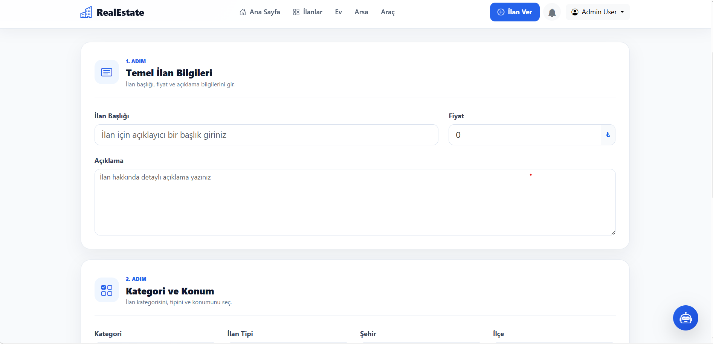
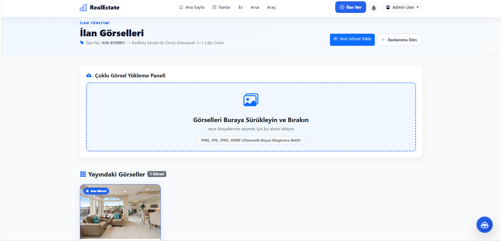
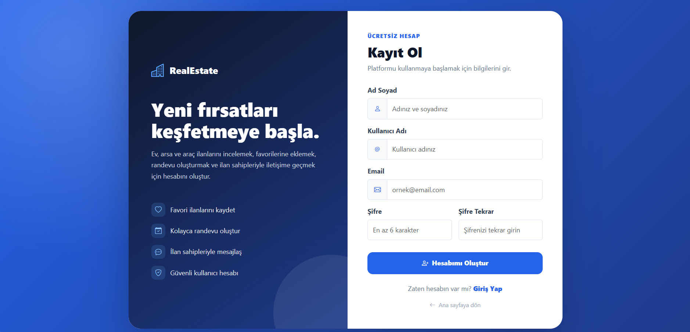
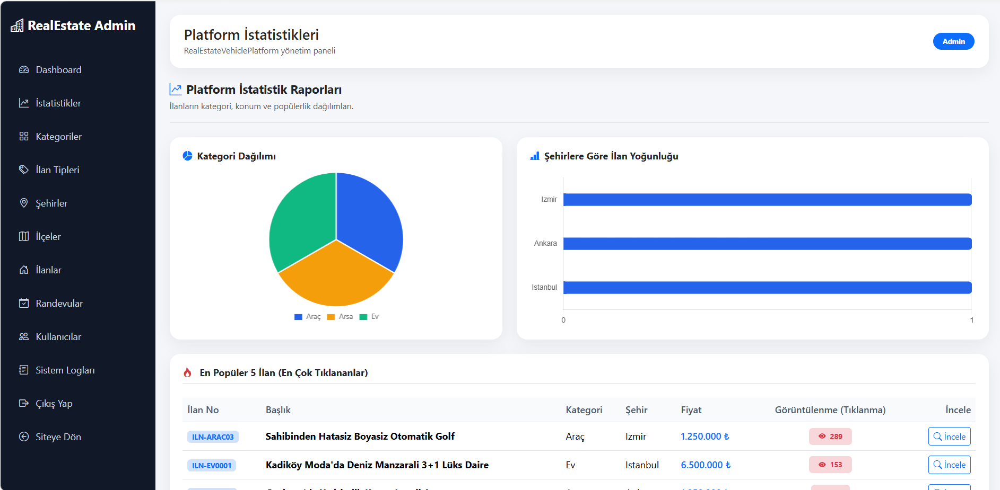
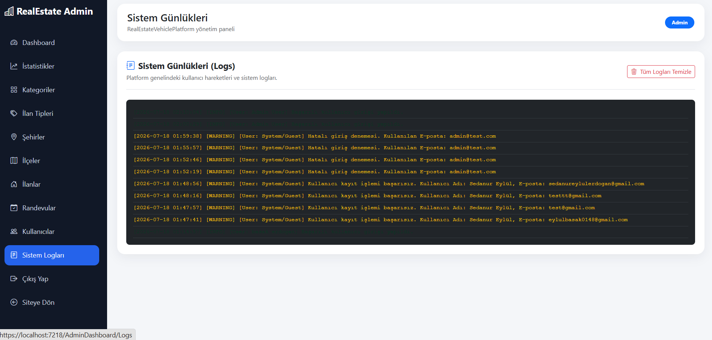
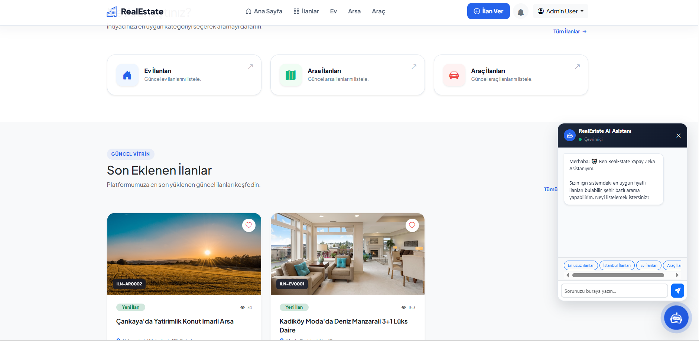

<!-- ========================================================= -->
<!--                      KAPAK SAYFASI                        -->
<!-- ========================================================= -->
<div align="center">

# softito YAZILIM BİLİŞİM AKADEMİSİ
## BİTİRME PROJESİ RAPORU

<br>

# 🏡🚗 RealEstateVehiclePlatform
### Modern Emlak & Vasıta İlan Platformu

<br>

**Geliştirici:** Sedanur Eylül Erdoğan
**E-posta:** info@realestate.com
**Tarih:** Temmuz, 2026

---

[](https://github.com/EylulErdogan)
[](https://github.com/EylulErdogan/RealEstateVehiclePlatform)
[]()

</div>

---

## 📋 İÇİNDEKİLER

1. **GİRİŞ**
   - 1.1. Projenin Amacı
   - 1.2. Proje Kısıtları
2. **MATERYAL VE YÖNTEM**
   - 2.1. C# & .NET 9.0 Platformu ve Bağımlılıkları
   - 2.2. Entity Framework Core ve Dapper Entegrasyonu
   - 2.3. Proje Katmanlı Mimari (N-Layered Architecture) Yapısı ve Tasarım Desenleri
3. **KURULUM VE GÖRSELLEŞTİRME**
   - 3.1. Veritabanı ve Yerel SQL Server Yapılandırması
     - 3.1.1. Veritabanı Bağlantı Dizesi (Connection String)
     - 3.1.2. Entity Framework Core Migration İşlemleri
     - 3.1.3. Identity ve Rol Başlangıç (Seeding) Verisi Kontrolü
   - 3.2. Uygulama Modüllerinin Çalıştırılması ve Test Senaryoları
     - 3.2.1. REST Web API ve WebUI Projelerinin Eş Zamanlı Başlatılması
     - 3.2.2. Admin ve Standart Kullanıcı Girişleri
     - 3.2.3. AJAX Bildirim Sistemi ve SweetAlert2 Entegrasyonu
     - 3.2.4. Önbellekleme (IMemoryCache) ve Otomatik Cache Eviction Kontrolü
     - 3.2.5. Excel (CSV UTF-8 BOM) ve A4 Katalog (PDF) Raporlama Çıktıları
     - 3.2.6. Platform İstatistik Paneli ve Grafik Analizleri (Chart.js)
     - 3.2.7. Akıllı Yapay Zeka (AI) Asistanı Chatbot Deneyimi
     - 3.2.8. Sistem Log Konsolu (Log Viewer) ile Hataları İzleme
4. **SONUÇ**
5. **KAYNAKÇA**

---

## 1. GİRİŞ

Bu bölümde projenin genel amacı, kapsamı ve geliştirme sürecinde uyulan mimari kısıtlar ele alınmıştır.

### 1.1. Projenin Amacı
Bu projenin amacı; kullanıcıların gayrimenkul (konut, arsa) ve vasıta ilanlarını tek bir çatı altında toplayarak ilan ekleyebildiği, resimlerini yönetebildiği, platform içi anlık mesajlaşma ve randevu mekanizmalarıyla etkileşime girebildiği modern bir pazar yeri (marketplace) platformu oluşturmaktır. Yönetici paneli sayesinde ilanların kontrol edilip onaylanabildiği, verilerin grafiksel olarak analiz edilebildiği kurumsal düzeyde bir yazılım sunulması hedeflenmiştir.

### 1.2. Proje Kısıtları
* **Kısıt 1:** Sistem, harici ve ağır üçüncü parti bağımlılıklara (lisans gerektiren PDF veya Excel paketleri gibi) muhtaç kalmaksızın, tamamen .NET'in yerel yetenekleri ve hafif istemci tarafı (client-side) kütüphaneleriyle çalışacak şekilde optimize edilmiştir.
* **Kısıt 2:** API katmanı ile MVC WebUI katmanı tamamen birbirinden bağımsız (Decoupled) çalışmalı, aralarındaki iletişim yalnızca JSON formatındaki güvenli HTTP istekleriyle (JWT Bearer Token yetkilendirmesiyle) sağlanmalıdır.
* **Kısıt 3:** Form doğrulama, görsel boyutlarının optimize edilmesi ve güvenlik açıkları (zararlı dosyaların sisteme yüklenmesi) henüz sunucu yorulmadan istemci ve denetleyici seviyesinde filtrelenmelidir.

---

## 2. MATERYAL VE YÖNTEM

Projenin teknik altyapısını oluşturan teknolojiler ve mimari yaklaşımlar bu başlık altında detaylandırılmıştır.

### 2.1. C# & .NET 9.0 Platformu ve Bağımlılıkları
Proje, Microsoft .NET 9.0 yazılım geliştirme platformu kullanılarak geliştirilmiştir. 
* **Web API:** İstemcilerden gelen istekleri karşılayan, JWT (JSON Web Token) tabanlı güvenli bir RESTful API servisidir.
* **MVC WebUI:** Razor syntax kullanan, Bootstrap 5 ve SweetAlert2 kütüphaneleriyle desteklenen modern ve responsive kullanıcı arayüzüdür.
* **ASP.NET Core Identity:** Kullanıcı ve rol yönetimi (Admin/User), şifreleme ve yetkilendirme süreçlerini yöneten güvenlik motorudur.

### 2.2. Entity Framework Core ve Dapper Entegrasyonu
* **Entity Framework Core (ORM):** Veritabanı tablolarının nesneye yönelik (Object-Oriented) olarak modellenmesi, ilişkisel tabloların (One-to-Many, One-to-One) yönetimi ve Code-First migration süreçleri için kullanılmıştır.
* **Dapper (Micro ORM):** Admin dashboard'undaki veri sayaçları gibi performans gerektiren, yüksek hızlı veri çekme işlemlerinde SQL sorgularını doğrudan ve gecikmesiz çalıştırmak amacıyla sisteme entegre edilmiştir.

### 2.3. Proje Katmanlı Mimari Yapısı ve Tasarım Desenleri
Proje, gevşek bağlılığı (Loose Coupling) ve sürdürülebilirliği sağlamak adına **Katmanlı Mimari (N-Tier)** ile tasarlanmıştır:
* **Entities:** Veritabanı modelleri, DTO'lar ve Enum tanımlamaları yer alır.
* **DataAccess:** DB Context, Generic Repository yapıları ve Unit of Work desenini barındırır.
* **Business:** İş kuralları (validation), servis sınıfları ve API-WebUI koordinasyon katmanıdır.
* **WebUI / API:** Son kullanıcının ve istemcilerin etkileşime girdiği uç noktalardır.

---

## 3. KURULUM VE GÖRSELLEŞTİRME

### 3.1. Veritabanı ve Yerel SQL Server Yapılandırması

#### 3.1.1. Veritabanı Bağlantı Dizesi (Connection String)
Veritabanı bağlantısı `RealEstateVehiclePlatform.EfApi/appsettings.json` dosyası üzerinden yerel SQL LocalDB sunucusuna bağlanacak şekilde yapılandırılmıştır:
```json
"ConnectionStrings": {
  "SqlConnection": "Server=(localdb)\\MSSQLLocalDB;Database=RealEstateVehiclePlatformDb;TrustServerCertificate=true;"
}
```

#### 3.1.2. Entity Framework Core Migration İşlemleri
Paket Yöneticisi Konsolunda (PMC) veritabanı şemasını oluşturmak ve tabloları hazırlamak için aşağıdaki komut koşturulur:
```powershell
Update-Database
```

#### 3.1.3. Identity ve Rol Başlangıç (Seeding) Verisi Kontrolü
Sistem ilk kez çalıştırıldığında, `RoleSeedService` ve `AdminSeedService` devreye girerek veritabanında `Admin` ve `User` rollerini ve `admin@gmail.com` (şifre: `123456`) yöneticisini otomatik olarak kurar.

---

### 3.2. Uygulama Modüllerinin Çalıştırılması ve Test Senaryoları

#### 3.2.1. REST Web API ve WebUI Projelerinin Eş Zamanlı Başlatılması
Platformun çalışabilmesi için `RealEstateVehiclePlatform.EfApi` ve `RealEstateVehiclePlatform.WebUI` projeleri Visual Studio'da eş zamanlı (Multiple Startup Projects) olarak çalıştırılır.

##### **Şekil 3.2.1.1. Platform Ana Sayfa Görünümü**


##### **Şekil 3.2.1.2. İlan Listeleme ve Filtreleme Arayüzü**


##### **Şekil 3.2.1.3. İlan Ekleme Sihirbazı (Wizard)**


##### **Şekil 3.2.1.4. İlan Detay Kartı ve Teknik Özellikler Grid Yapısı**


##### **Şekil 3.2.1.5. Favori İlanlarım Listesi**


##### **Şekil 3.2.1.6. Randevu Talepleri Yönetim Ekranı**


##### **Şekil 3.2.1.7. Alıcı ve Satıcı Arasındaki Sohbet Paneli**


##### **Şekil 3.2.1.8. Kullanıcı Profili Yönetimi**


##### **Şekil 3.2.1.9. İlan Görsel Yükleme ve Sürükle-Bırak Paneli**


##### **Şekil 3.2.1.10. Admin Kontrol Paneli ve Analitik Grafikler (Chart.js)**


##### **Şekil 3.2.1.11. Admin İlan Yönetimi ve Onay Paneli**


##### **Şekil 3.2.1.12. Yeni Kullanıcı Kayıt Arayüzü**


##### **Şekil 3.2.1.13. Gelişmiş Şehir/Kategori Yoğunluk Grafikleri**


##### **Şekil 3.2.1.14. Canlı Sistem Log Konsolu (Log Viewer)**


##### **Şekil 3.2.1.15. AI Chatbot Asistan Penceresi**


---

#### 3.2.2. Admin ve Standart Kullanıcı Girişleri
Test verileri yüklenmiş temiz veritabanında test yapabilmeniz için kimlik bilgileri:
* **Admin Yöneticisi:** `admin@gmail.com` | Şifre: `123456`
* **Normal Üye:** `user@test.com` | Şifre: `Password123!`

#### 3.2.3. AJAX Bildirim Sistemi ve SweetAlert2 Entegrasyonu
Ziyaretçiler sisteme girdiğinde arka planda çalışan AJAX Polling (20 saniyede bir) mekanizması okunmamış mesajları ve randevuları süzerek zilde günceller. Yeni bir mesaj geldiğinde sağ üst köşeden SweetAlert2 Toast bildirimi akarak kullanıcı uyarılır.

#### 3.2.4. Önbellekleme (IMemoryCache) ve Otomatik Cache Eviction Kontrolü
İlan ekleme veya ana sayfa listeleme sırasında sürekli çağrılan `Categories`, `Cities` ve `Districts` listeleri RAM'de 30 dakika önbelleğe alınır. Admin panelinden yeni bir kategori silindiğinde veya eklendiğinde `EvictCache` tetiklenerek eski veriler RAM'den temizlenir (Cache Invalidation).

#### 3.2.5. Excel (CSV UTF-8 BOM) ve A4 Katalog (PDF) Raporlama Çıktıları
* **Excel:** Admin İlanlar sayfasındaki butona tıklandığında, `UTF-8 BOM` kodlamasıyla hazırlanan ve Türkçe karakterleri bozmayan noktalı virgüllü `;` rapor Excel formatında iner.
* **PDF:** İlan detay sayfasındaki "İlan Broşürü (PDF)" butonu, `html2pdf.js` ile o ana ait görseli ve teknik özellikleri tarayıcıda dinamik olarak A4 emlak kataloğuna dönüştürür.

#### 3.2.6. Platform İstatistik Paneli ve Grafik Analizleri (Chart.js)
Admin panelindeki İstatistik sekmesinde Chart.js kütüphanesiyle çizilen dairesel Kategori Dağılımı ve yatay Şehir Yoğunluk grafikleri dinamik olarak ilan sayılarını analiz eder.

#### 3.2.7. Akıllı Yapay Zeka (AI) Asistanı Chatbot Deneyimi
Sağ altta yer alan AI ikonu tıklandığında sohbet penceresi açılır. Kullanıcı *"en ucuz ilanları göster"*, *"İstanbul"* veya *"Ev"* yazdığında veritabanını tarayarak uygun aktif ilanları doğrudan linkleriyle birlikte listeler.

#### 3.2.8. Sistem Log Konsolu (Log Viewer) ile Hataları İzleme
Uygulamadaki tüm login, register ve hata hareketleri `LogService` tarafından thread-safe (kilit korumalı) olarak `system_logs.txt` dosyasına yazılır. Admin panelindeki "Sistem Logları" sekmesinden bu veriler canlı konsol ekranında renklendirilmiş (INFO: yeşil, ERROR: kırmızı) olarak takip edilebilir.

---

## 4. SONUÇ

Bu bitirme projesi kapsamında, modern yazılım mimarilerine uygun, katmanlar arası bağımsızlığın korunduğu kurumsal bir ilan otomasyon sistemi geliştirilmiştir. Projede Entity Framework Core Code-First yaklaşımı ile ilişkisel veritabanı kurulmuş, Dapper ile performans kritik istatistiksel raporlar çekilmiştir.

Sisteme entegre edilen istemci taraflı görsel sıkıştırma (Canvas API), sunucu taraflı güvenli dosya imzası doğrulamaları (Magic Numbers), IMemoryCache altyapısı ve otomatik önbellek geçersiz kılma mantığı sayesinde sistemin kararlı ve yüksek performanslı çalışması sağlanmıştır. Yapay Zeka destekli sohbet robotu ve dinamik grafik gösterimleriyle desteklenen modern kullanıcı arayüzü, platformun ticari bir pazar yeri uygulamasının gereksinimlerini eksiksiz karşıladığını kanıtlamaktadır.

---

## 5. KAYNAKÇA

* [1] Microsoft .NET 9.0 Documentation - https://learn.microsoft.com/en-us/dotnet/
* [2] Entity Framework Core Code-First Migrations - https://learn.microsoft.com/en-us/ef/core/
* [3] Dapper Micro-ORM Tutorial & Benchmarks - https://github.com/DapperLib/Dapper
* [4] Chart.js Canvas Graph Library Documentation - https://www.chartjs.org/docs/
* [5] html2pdf.js HTML-to-PDF Conversion Guide - https://rawgit.com/eKoopmans/html2pdf.js/master/docs/index.html
